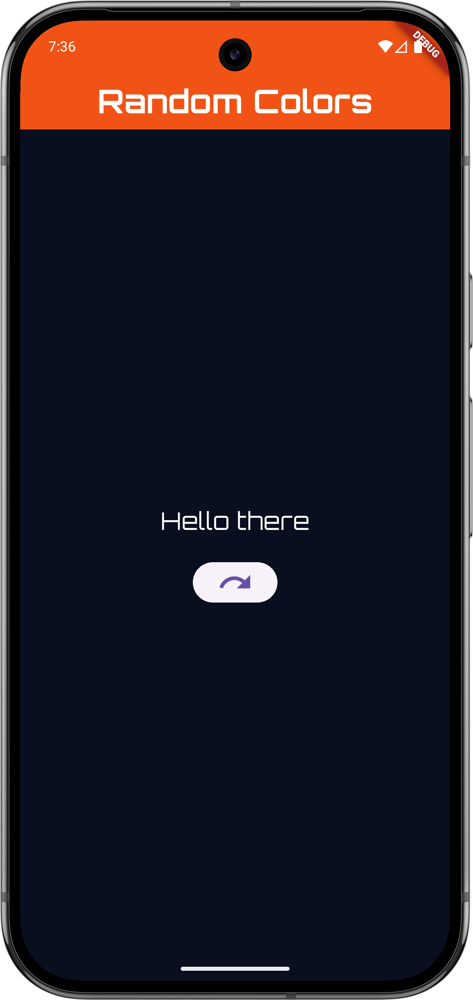
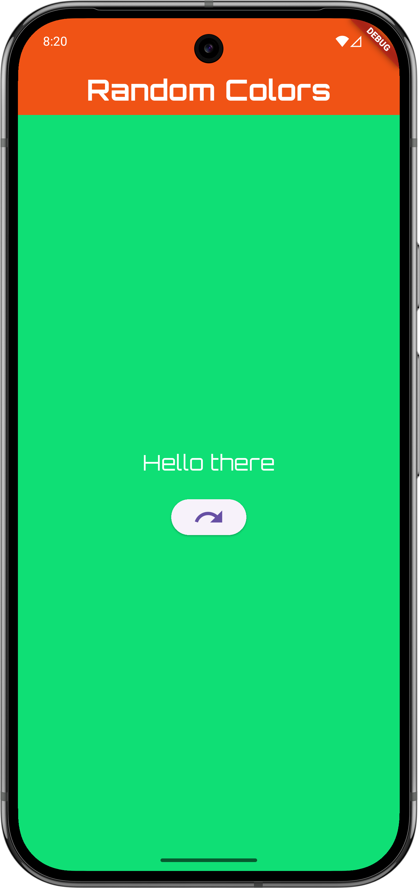

# Random colors

Test application for SolidSoftware, written on Dart/Flutter stack.

Added packages:
- google_fonts: ^6.3.0
- solid_lints: ^0.3.1

## What's in there

I made single screen with changing background on tap, and resetting to its original color by clicking the button.
In this project, I tried to apply different approaches, and I often had to use StackOverflow and Google. But at least it proves my research skills))

## Demo

|  |  |
|-----------------------------|-----------------------------|
